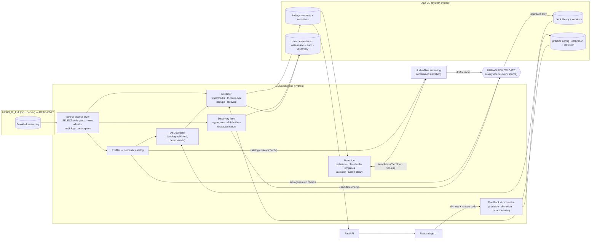

# ARCHITECTURE.md — CDSS Anomaly Detection over INDICI_BI_Full

The system reads an existing healthcare BI database (`INDICI_BI_Full`, MS SQL Server) **exclusively through provided read-only views**, evaluates a library of versioned, human-approved anomaly checks compiled to deterministic SQL, materializes findings with a lifecycle into its own application database, narrates each finding through a constrained LLM layer that cannot introduce facts, and learns from reason-coded staff feedback. LLMs author and narrate; **SQL decides**.

All view/column names cited below come from `schema_for_SQL_PROJ.txt` (56 objects, 2,027 columns) and are treated as hypotheses until the Phase 1 empirical catalog confirms them (see D-017 in `DECISIONS.md`).

---

## 1. One-paragraph theory of operation

A **semantic catalog** (built by automated profiling in Phase 1) describes every view: columns, types, null rates, cardinalities, candidate keys, cross-view join/containment relationships, value domains, sentinel values, watermark candidates. **Checks** — YAML predicates in a small DSL — are drafted from four sources (profiling, LLM, discovery promotion, hand-authored), pass one human review gate, and compile deterministically against the catalog into set-based T-SQL over the views. An **executor** runs them incrementally on watermarks, evaluates each entity to pass / fail / **indeterminate**, and upserts deduplicated **findings** carrying deterministic evidence fields. A **narration layer** turns evidence into prose via placeholder templates the LLM writes but never fills — values are interpolated by code, and a validator blocks any number/date/code not in the evidence allowlist. **Feedback** (mandatory reason codes on dismissal) drives per-practice precision tracking, auto-demotion, and parameter recalibration. A **discovery lane** watches distributions and drafts candidate checks into the review gate; it can never create a staff-facing finding.

## 2. Findings F1–F12 → design mapping

All twelve adopted unrevised (D-012). This table is the compliance map; each row names the owning component and the phase that delivers it.

| Finding | Adopted design | Component(s) | Phase |
|---|---|---|---|
| F1 — LLM authors/narrates, SQL decides | LLM appears only in offline check drafting, narrative templating, discovery characterization. Runtime anomaly decisions are compiled SQL only. No code path sends a row to an LLM for judgment. | check-authoring, narration, discovery | 4, 5, 7 |
| F2 — Everything compiles to checks | Findings carry `check_id` + `check_version_id` (FK-enforced, NOT NULL). A finding without a check cannot be inserted. | app DB schema, executor | 3 |
| F3 — Four sources, one review gate | `checks.source ∈ {profiling, llm, discovery, manual}`; all enter `status=draft` → `in_review` → `active/rejected`. Review CLI (Phase 4), review UI (Phase 10). Gate cannot be bypassed: executor only loads `status=active`. | check library, review gate | 4 |
| F4 — Predicate ≠ parameters | DSL declares typed params with default *strategies* (fixed or learned percentile). Values live per practice in `practice_check_config`, seeded by the calibration job from that practice's own distributions. | DSL, calibration | 2, 4, 6 |
| F5 — Feedback closes the loop | Dismissal requires a reason code (enum). Per-check-per-practice precision computed on schedule; below-floor checks auto-demote for that practice only. First-class subsystem with its own phase. | feedback & calibration | 6 |
| F6 — Three-valued evaluation | DSL has explicit `prerequisites`; compiler emits tri-state CASE logic; executor stores pass/fail/indeterminate counts per execution. Indeterminacy rate above threshold emits a system data-quality finding. | DSL, compiler, executor | 2, 3 |
| F7 — Findings store with lifecycle | `findings` table: dedupe key, `open → acknowledged → dismissed(reason) / resolved`, snooze, first/last-seen run tracking, append-only `finding_events`. | app DB, executor | 3 |
| F8 — Constrained explanation | Evidence extracted by executor; LLM writes placeholder templates and picks actions only from the check's allowed set in the curated action library; validator enforces exact provenance of every number/date/code; deterministic fallback template per check. | narration layer | 5 |
| F9 — Discovery never alerts | Discovery writes to `discovery_signals`/`discovery_candidates` only. No code path from the discovery lane to `findings`. Promotions become draft checks in the review gate. | discovery lane | 7 |
| F10 — Scale discipline | Set-based SQL; watermarks on `InsertedAt`/`UpdatedAt` (present on 43–41 of 56 views; fallback strategy for the rest, Phase 3); per-check cost capture every run; expensive checks → `ASK-NNN` entries, never base-table workarounds. LLM cost is O(checks + findings). | executor | 3 |
| F11 — Evaluation harness | Synthetic anomaly injection into a mutable test copy, paired to expected checks → recall. Precision from live reason-coded feedback. Versioned gold sets. CI regression gate. | eval harness | 8 |
| F12 — Unusual ≠ wrong | Only `status=active` checks produce findings; discovery output is internal (F9); calibration keys thresholds to each practice's own distributions (F4), not global norms. | whole pipeline | — |

## 3. Component diagram



## 4. Data flow — one scheduled run

1. **Preflight.** Load active checks + per-practice config; verify live view schema against the catalog version the checks were compiled for (drift → affected checks skipped as indeterminate, `schema_drift_events` row, run continues).
2. **Increment scope.** For each check's driving view: read watermark (`watermarks` table), scope this run to `UpdatedAt/InsertedAt > watermark` plus the check's declared lookback window; views without watermark columns use the fallback strategy (Phase 3).
3. **Execute.** Compiled parameterized SQL per (check, practice) — set-based, `SELECT`-only, through the source access layer (audited, timed, row-counted). Result rows carry entity keys + evidence fields + tri-state.
4. **Materialize.** Upsert findings by `dedupe_key = hash(check_id, canonical entity key)`: new → `open`; existing → bump `last_seen`; previously failing entity now passing → auto-resolve (`resolved_system`) if the check opts in; snoozed → suppressed from queue, still tracked.
5. **Narrate.** New findings get narratives (Tier S pipeline, §7); on LLM outage or validator block, the deterministic fallback template renders — findings are never delayed by narration.
6. **Account.** Per-check cost (duration, rows examined, tri-state counts) → `check_executions`; run totals → `runs`; audit continues throughout.

## 5. Check DSL (sketch — Phase 2 finalizes)

YAML, validated by JSON Schema, compiled to T-SQL. Illustrative example using real export names:

```yaml
id: appointment-completed-no-invoice
title: Completed appointment has no invoice
category: revenue-integrity          # referential | data-quality | workflow | care-gap | revenue-integrity | policy
default_severity: medium
entity:
  view: dbo.Appointments
  key: [AppointmentID]
  practice_column: PracticeID
  base_filters:                      # standard exclusions, defaults injected from catalog
    - "IsDeleted = 0"
    - "IsDummy = 0"
params:
  invoice_lag_days:
    type: integer
    default: { strategy: percentile, measure: appointment_to_invoice_lag, p: 95, fallback: 7 }
prerequisites:                       # any NULL/false ⇒ INDETERMINATE, never a flag (F6)
  - "AppointmentCompleted IS NOT NULL"
  - "ScheduleDate IS NOT NULL"
predicate:                           # TRUE ⇒ FAIL, FALSE ⇒ PASS, NULL ⇒ INDETERMINATE
  all:
    - "AppointmentCompleted = 1"
    - "ScheduleDate <= DATEADD(day, -{invoice_lag_days}, sysdatetime())"
    - not_exists:
        view: dbo.Invoices
        on: "dbo.Invoices.AppointmentID = dbo.Appointments.AppointmentID"
        where: "dbo.Invoices.IsActive = 1"
evidence: [AppointmentID, PatientID, ScheduleDate, AppointmentType, Provider, PracticeID]
actions: [verify-invoice, raise-billing-task]    # must exist in action library
resolution: "An active invoice exists for the appointment, or the finding is dismissed with a reason."
```

**Three-valued semantics (normative).** Per entity row: (1) all `base_filters` applied in the driving query; (2) if any prerequisite evaluates NULL or FALSE → **indeterminate**; (3) else predicate TRUE → **fail**, FALSE → **pass**, NULL → **indeterminate** (SQL NULL propagation is caught, never coerced). The compiler emits a single set-based statement computing the tri-state for the whole increment; the executor never loops rows in Python. Constructs: `all/any/not`, comparisons, null tests, date arithmetic, `exists/not_exists` with declared join, `in` against catalog-declared domains, window lookbacks. The compiler validates every referenced view/column/join against the semantic catalog and refuses to compile otherwise (F2: no check can reference what the catalog doesn't know).

**Determinism.** `(DSL doc, params, catalog version, dialect)` → byte-identical SQL, hashed (`sql_hash`) and recorded per execution; golden-SQL snapshot tests pin this in CI.

## 6. Application database (draft — Phase 3 finalizes as migrations)

Engine per D-005 (recommendation: PostgreSQL 16). All timestamps UTC. `practice_id` everywhere it is per-org (D-008).

**Check library**
- `checks` — id, slug (unique), title, category, default_severity, source `{profiling|llm|discovery|manual}`, status `{draft|in_review|active|rejected|retired}`, created_at/by
- `check_versions` — id, check_id →, version_no, definition (JSONB, the YAML parsed), definition_hash, rationale, affected_views[], params_schema, resolution_guidance, author, reviewed_by/at/note; **immutable rows**; exactly one active version per active check
- `action_library` — action_code (pk), label, operational_description, is_active — curated by humans, never LLM-written
- `check_actions` — check_id →, action_code → (the per-check allowlist F8 narration may select from)

**Per-practice configuration & learning**
- `practices` — practice_id (from source `PracticeID`), name, is_active
- `practice_check_config` — practice_id ×, check_id ×, enabled, demoted (+ demoted_at/reason), params (JSONB), params_source `{default|learned|manual}`, updated_at/by
- `calibration_runs` — id, practice_id, job started/finished, params_before/after, distribution_snapshot (JSONB: the empirical percentiles used), triggered_by
- `precision_stats` — practice_id ×, check_id ×, window_start/end, n_feedback, n_genuine, precision, computed_at

**Execution & findings**
- `runs` — id, started/finished_at, status, trigger `{scheduled|manual|eval}`, git_sha, catalog_version, totals (JSONB)
- `check_executions` — id, run_id →, check_version_id →, practice_id, sql_hash, watermark_from/to, duration_ms, rows_examined, n_pass, n_fail, n_indeterminate, status
- `watermarks` — view_name ×, column_name, last_value, updated_at
- `findings` — id, practice_id, check_id →, check_version_id →, entity_type, entity_key (JSONB, canonical), dedupe_key (unique with check_id), severity, status `{open|acknowledged|dismissed|resolved_system|resolved_user}`, evidence (JSONB — deterministic values only), first/last_seen_run_id →, first/last_seen_at, snoozed_until
- `finding_events` — id, finding_id →, event `{created|reseen|acknowledged|dismissed|resolved|reopened|snoozed|narrated}`, actor, reason_code `{expected_variation|data_entry_lag|policy_difference|genuine_issue|other}` (NOT NULL when event=dismissed), note, at — **append-only**
- `narratives` — id, finding_id →, template_text, rendered_text, model_id, prompt_hash, validation_status `{passed|blocked_fell_back|fallback_static}`, validation_report (JSONB), actions_selected[], created_at

**Discovery & governance**
- `discovery_signals` — id, lane `{drift|outlier}`, scope (JSONB), signal (JSONB), score, run_id →, status `{new|triaged|characterized|promoted|discarded}`
- `discovery_candidates` — id, signal_ids[], draft_definition (JSONB), llm_rationale, created_at → becomes a `checks` row (source=discovery, status=draft)
- `source_audit_log` — id, at, component, statement, params (JSONB), duration_ms, rows_returned, run_id?, purpose (mirrors the JSONL trail, D-016)
- `catalog_versions` — id, version, produced_at, artifact_hash, storage_path
- `schema_drift_events` — id, at, view_name, expected vs observed (JSONB), action_taken

## 7. Explanation layer & PHI boundary (F8; D-003/D-004)

**Placeholder-template narration (Tier S — default).** For a new finding: (1) executor has already stored typed evidence values; (2) the LLM receives the check's rationale, category, resolution guidance, the **names and types** of evidence fields and params, and the allowed action codes — **no values**; (3) it returns a narrative template (`"This {{AppointmentType}} appointment on {{ScheduleDate}} was completed, but no active invoice exists after {{invoice_lag_days}} days."`) plus selected action codes; (4) the renderer interpolates real values deterministically; (5) the **validator** enforces: every placeholder ∈ evidence ∪ params; every numeric/date/code-like token in the *rendered* text traceable to interpolation, the action library's fixed copy, or an approved static vocabulary; actions ⊆ the check's allowlist. Violation ⇒ narrative blocked, deterministic fallback template (authored with the check, human-reviewed) renders instead, `validation_status` records it. Templates are cached per (check_version, evidence-shape), so LLM calls are O(checks), not O(findings).

Fabrication is thus structurally impossible — the LLM never emits a value, and text that smuggles one in is blocked (prohibition 3, validator-enforced). Under Tier S the runtime LLM boundary carries **zero PHI**; Tier M (offline authoring/discovery) carries catalog metadata and aggregates only. Both tiers sit behind a `CDSS_REDACTION_MODE` config; there is no "off" mode in production builds.

## 8. Feedback, calibration, demotion (F4/F5)

Dismissal without a reason code is rejected at the API layer. A scheduled job recomputes per-(practice, check) precision = genuine_issue / all-reason-coded-feedback over the trailing window; below the floor (D-011 default 0.30 over trailing 50, min 10) the check auto-demotes **for that practice** (`practice_check_config.demoted`), stays live elsewhere, and surfaces in the admin UI with its stats. Recalibration recomputes learned parameters (declared `strategy: percentile` in the DSL) from the practice's own current distributions, records before/after in `calibration_runs`, and never silently widens a threshold — parameter shifts appear in the run report.

## 9. Discovery lane (F9/F12)

Engineered per-entity/per-practice aggregates (e.g., weekly invoice-lag percentiles, recall-completion rates, inbox-aging distributions) land in app-DB tables. Detectors are deliberately boring and robust (median/MAD z-scores, week-over-week drift vs. seasonal baseline) and write `discovery_signals` — an **internal** queue. The LLM (Tier M) periodically characterizes recurring signals and drafts candidate checks with rationale into the review gate. Hard guarantee, enforced by construction and by test: the discovery lane has no write path to `findings`.

## 10. Evaluation harness (F11)

A mutation catalog pairs each injectable anomaly with the check expected to catch it (delete an appointment's invoices → `appointment-completed-no-invoice`; orphan a `LabRad` row; shift `Recalls.ReCallDate` past due). Injections run only against the designated test copy (D-009), never the production source (guarded by connection-string allowlist). Recall = caught/injected per check; precision comes from live reason-coded feedback (Phase 6 data); gold finding sets are versioned fixtures; CI fails on recall regression against the gold baseline.

## 11. Cross-cutting

- **Views-only enforcement (defense in depth):** read-only account (server-side) + client-side SQL gate that parses every outbound statement (sqlglot), rejecting anything that is not a single `SELECT` against the view allowlist (from the catalog) or an approved metadata query (D-015). The gate is unit-tested against injection of DML/DDL/base-table names.
- **Audit (constraint 7):** every source statement → JSONL + `source_audit_log` (D-016): statement, params, timestamp, duration, rows, initiating component, run id.
- **Secrets:** environment variables only (`CDSS_SOURCE_*`, `CDSS_APP_DB_URL`, `CDSS_LLM_API_KEY`, …); `.env` gitignored; no secret ever logged — enforced by a log-scrubbing test.
- **Observability:** structlog JSON logs with run/request ids; Prometheus-format metrics (run duration, per-check cost, findings by status, narration validation blocks, LLM failures); run dashboard in the UI (Phase 10/11).
- **Schema drift:** catalog-pinned compilation + preflight live-schema comparison (§4.1) turns silent breakage into explicit, indeterminate-not-false results and a drift event.
- **PHI at rest:** evidence JSONB contains the minimum fields each check declares; app-DB access is role-gated; retention per D-011.

## 12. Known risks (tracked, not hand-waved)

| Risk | Evidence | Mitigation | Where |
|---|---|---|---|
| The 56 export objects may not be the provided views | Entries labeled `"table"`, names like base tables | D-001 blocks Phase 0 exit; live enumeration reconciles | Phase 0 |
| 12 objects lack `InsertedAt`/`UpdatedAt` → no watermark (incl. `dbo.LabRad`, `dbo.NESEnrolment`, `dbo.PendingFinishCounsult`) | Export column lists | Per-view fallback: bounded full scan within lookback window, or snapshot-hash diff; if a view is both hot and unwatermarkable → `ASK-NNN` for an exposed change column | Phase 3 |
| Export semantics wrong (e.g., `AppointmentCompleted` meaning) | D-017 | Phase 1 empirical profiling + Phase 4 review gate rejects checks whose fixtures contradict live data | Phases 1, 4 |
| Views hide expensive joins; some checks slow at millions of rows | F10 warning; `dbo.Patient` alone has ~190 columns | Per-check cost capture from first run; cost budget per check; optimization asks over workarounds | Phases 3, 8 |
| Alert fatigue | F5: primary failure mode of the product class | Reason codes mandatory, per-practice precision, auto-demotion, snooze, dedup — built in Phases 3/6, not bolted on | Phases 3, 6 |
| Test records polluting findings | `Patient.IsTestRecord`, `Appointments.IsDummy` exist in export | Catalog marks test-record indicators; standard base_filters exclude them; profiling quantifies their share | Phases 1, 2 |
