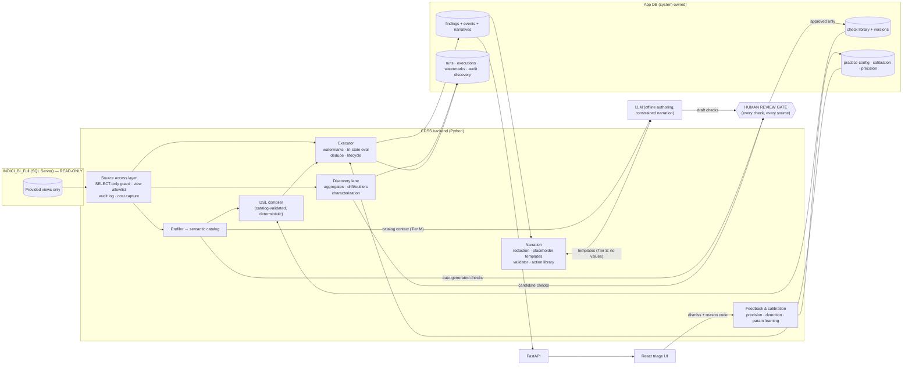

# ARCHITECTURE.md — CDSS Anomaly Detection over INDICI_BI_Full

The system reads an existing healthcare BI database (`INDICI_BI_Full`, MS SQL Server) **exclusively through provided read-only views**, evaluates a library of versioned, human-approved anomaly checks compiled to deterministic SQL, materializes findings with a lifecycle into its own application database, narrates each finding through a constrained LLM layer that cannot introduce facts, and learns from reason-coded staff feedback. LLMs author and narrate; **SQL decides**.

All view/column names cited below come from `schema_for_SQL_PROJ.txt` — **54 objects, 1,996 columns** (2026-07-15: reduced from the original 56/2,027 by D-001, which dropped `dbo.PracticeStats` and `AIFinanceAssistant.tblSalary` from scope — see `DECISIONS.md` D-001) — and are treated as hypotheses until the Phase 1 empirical catalog confirms them (D-017). Detail beyond what's needed for a cross-component picture lives in the owning phase spec (`docs/phases/phase-NN-*.md`); this file does not duplicate it.

One-paragraph theory of operation: a **semantic catalog** (Phase 1 profiling) describes every view — columns, types, null rates, cardinalities, candidate keys, join/containment relationships, value domains, watermark candidates. **Checks** — YAML predicates in a small DSL — are drafted from four sources (profiling, LLM, discovery promotion, hand-authored), pass one human review gate, and compile deterministically against the catalog into set-based T-SQL over the views. An **executor** runs them incrementally on watermarks, evaluates each entity to pass / fail / **indeterminate**, and upserts deduplicated **findings** carrying deterministic evidence fields. A **narration layer** turns evidence into prose via placeholder templates the LLM writes but never fills — values are interpolated by code, and a validator blocks any number/date/code not in the evidence allowlist. **Feedback** (mandatory reason codes on dismissal) drives per-practice precision tracking, auto-demotion, and parameter recalibration. A **discovery lane** watches distributions and drafts candidate checks into the review gate; it can never create a staff-facing finding.

---

## 1. Diagrams

### 1.1 Component diagram



### 1.2 Data flow — one scheduled run

1. **Preflight.** Load active checks + per-practice config; verify live view schema against the catalog version the checks were compiled for (drift → affected checks skipped as indeterminate, `schema_drift_events` row, run continues).
2. **Increment scope.** For each check's driving view: read watermark (`watermarks` table), scope this run to `UpdatedAt/InsertedAt > watermark` plus the check's declared lookback window; views without watermark columns use the fallback strategy (Phase 3).
3. **Execute.** Compiled parameterized SQL per (check, practice) — set-based, `SELECT`-only, through the source access layer (audited, timed, row-counted). Result rows carry entity keys + evidence fields + tri-state.
4. **Materialize.** Upsert findings by `dedupe_key = hash(check_id, canonical entity key)`: new → `open`; existing → bump `last_seen`; previously failing entity now passing → auto-resolve (`resolved_system`) if the check opts in; snoozed → suppressed from queue, still tracked.
5. **Narrate.** New findings get narratives (Tier S pipeline, §3.2); on LLM outage or validator block, the deterministic fallback template renders — findings are never delayed by narration.
6. **Account.** Per-check cost (duration, rows examined, tri-state counts) → `check_executions`; run totals → `runs`; audit continues throughout.

---

## 2. Components

### 2.1 Source access layer
Single audited choke point over `INDICI_BI_Full`. Defense in depth: read-only account (server-side) + client-side SQL gate (sqlglot) that parses every outbound statement and rejects anything that is not a single `SELECT` against the view allowlist (from the catalog) or an approved metadata query (D-015). Unit-tested against injection of DML/DDL/base-table names. Every statement is audited (constraint 7): JSONL from day one + `source_audit_log` from Phase 3 (D-016) — statement, params, timestamp, duration, rows, initiating component, run id.

### 2.2 Profiler → semantic catalog
Phase 1. Automated profiling of every in-scope view producing the machine-readable semantic catalog (columns, types, null rates, cardinalities, candidate keys, cross-view relationships, value domains, sentinel values, watermark candidates) that every downstream component treats as authoritative (D-017 — supersedes `schema_for_SQL_PROJ.txt`).

### 2.3 DSL & compiler
Phase 2. YAML predicate DSL, validated by JSON Schema, compiled deterministically to T-SQL over the views. Illustrative example using real export names:

```yaml
id: appointment-completed-no-invoice
title: Completed appointment has no invoice
category: revenue-integrity          # referential | data-quality | workflow | care-gap | revenue-integrity | policy
default_severity: medium
entity:
  view: dbo.Appointments
  key: [AppointmentID]
  practice_column: PracticeID
  base_filters:                      # standard exclusions, defaults injected from catalog
    - "IsDeleted = 0"
    - "IsDummy = 0"
params:
  invoice_lag_days:
    type: integer
    default: { strategy: percentile, measure: appointment_to_invoice_lag, p: 95, fallback: 7 }
prerequisites:                       # any NULL/false ⇒ INDETERMINATE, never a flag (F6)
  - "AppointmentCompleted IS NOT NULL"
  - "ScheduleDate IS NOT NULL"
predicate:                           # TRUE ⇒ FAIL, FALSE ⇒ PASS, NULL ⇒ INDETERMINATE
  all:
    - "AppointmentCompleted = 1"
    - "ScheduleDate <= DATEADD(day, -{invoice_lag_days}, sysdatetime())"
    - not_exists:
        view: dbo.Invoices
        on: "dbo.Invoices.AppointmentID = dbo.Appointments.AppointmentID"
        where: "dbo.Invoices.IsActive = 1"
evidence: [AppointmentID, PatientID, ScheduleDate, AppointmentType, Provider, PracticeID]
actions: [verify-invoice, raise-billing-task]    # must exist in action library
resolution: "An active invoice exists for the appointment, or the finding is dismissed with a reason."
```

**Three-valued semantics (normative).** Per entity row: (1) all `base_filters` applied in the driving query; (2) if any prerequisite evaluates NULL or FALSE → **indeterminate**; (3) else predicate TRUE → **fail**, FALSE → **pass**, NULL → **indeterminate** (SQL NULL propagation is caught, never coerced). The compiler emits a single set-based statement computing the tri-state for the whole increment; the executor never loops rows in Python. Constructs: `all/any/not`, comparisons, null tests, date arithmetic, `exists/not_exists` with declared join, `in` against catalog-declared domains, window lookbacks. The compiler validates every referenced view/column/join against the semantic catalog and refuses to compile otherwise (F2: no check can reference what the catalog doesn't know).

**Determinism.** `(DSL doc, params, catalog version, dialect)` → byte-identical SQL, hashed (`sql_hash`) and recorded per execution; golden-SQL snapshot tests pin this in CI.

### 2.4 Executor
Phase 3. Runs compiled checks incrementally on watermarks (§1.2), evaluates tri-state per entity, upserts deduplicated findings. Set-based SQL only; per-check cost capture every run; expensive checks → `ASK-NNN` entries, never base-table workarounds. LLM cost is O(checks + findings), never O(rows).

### 2.5 App database
Draft — Phase 3 finalizes as migrations. Engine per D-005 (open; recommendation PostgreSQL 16). All timestamps UTC. `practice_id` everywhere it is per-org (D-008).

**Check library:** `checks` (id, slug, title, category, default_severity, source `{profiling|llm|discovery|manual}`, status `{draft|in_review|active|rejected|retired}`) · `check_versions` (immutable, definition JSONB, definition_hash, rationale, affected_views[], params_schema, reviewed_by/at) · `action_library` (curated, human-written only) · `check_actions` (per-check allowlist for F8 narration).

**Per-practice configuration & learning:** `practices` · `practice_check_config` (enabled, demoted, params JSONB, params_source) · `calibration_runs` · `precision_stats`.

**Execution & findings:** `runs` · `check_executions` (sql_hash, watermark_from/to, duration_ms, rows_examined, n_pass/fail/indeterminate) · `watermarks` · `findings` (dedupe_key, status lifecycle, evidence JSONB) · `finding_events` (append-only, reason_code NOT NULL when dismissed) · `narratives` (template_text, rendered_text, validation_status).

**Discovery & governance:** `discovery_signals` · `discovery_candidates` · `source_audit_log` (mirrors the JSONL trail, D-016) · `catalog_versions` · `schema_drift_events`.

### 2.6 Narration layer (F8; D-003/D-004)
Phase 5. **Placeholder-template narration (Tier S — default).** For a new finding: (1) executor has already stored typed evidence values; (2) the LLM receives the check's rationale, category, resolution guidance, the **names and types** of evidence fields and params, and the allowed action codes — **no values**; (3) it returns a narrative template plus selected action codes; (4) the renderer interpolates real values deterministically; (5) the **validator** enforces every placeholder ∈ evidence ∪ params, every numeric/date/code-like token traceable to interpolation or approved static vocabulary, actions ⊆ the check's allowlist. Violation ⇒ blocked, deterministic fallback template renders instead. Templates cache per (check_version, evidence-shape) — LLM calls are O(checks), not O(findings).

Fabrication is structurally impossible: the LLM never emits a value, and text that smuggles one in is blocked (validator-enforced). Under Tier S the runtime LLM boundary carries **zero PHI**; Tier M (offline authoring/discovery) carries catalog metadata and aggregates only. Both tiers sit behind `CDSS_REDACTION_MODE`; there is no "off" mode in production builds.

### 2.7 Feedback & calibration (F4/F5)
Phase 6. Dismissal without a reason code is rejected at the API layer. A scheduled job recomputes per-(practice, check) precision = genuine_issue / all-reason-coded-feedback over the trailing window; below the floor (D-011 default 0.30 over trailing 50, min 10) the check auto-demotes **for that practice** (`practice_check_config.demoted`), stays live elsewhere, surfaces in the admin UI with its stats. Recalibration recomputes learned parameters from the practice's own current distributions, records before/after in `calibration_runs`, never silently widens a threshold.

### 2.8 Discovery lane (F9/F12)
Phase 7. Engineered per-entity/per-practice aggregates (weekly invoice-lag percentiles, recall-completion rates, inbox-aging distributions) land in app-DB tables. Detectors are deliberately boring and robust (median/MAD z-scores, week-over-week drift vs. seasonal baseline) and write `discovery_signals` — an **internal** queue. The LLM (Tier M) periodically characterizes recurring signals and drafts candidate checks with rationale into the review gate. Hard guarantee, enforced by construction and by test: no write path to `findings`.

### 2.9 Evaluation harness (F11)
Phase 8. A mutation catalog pairs each injectable anomaly with the check expected to catch it (delete an appointment's invoices → `appointment-completed-no-invoice`; orphan a `LabRad` row; shift `Recalls.ReCallDate` past due). Injections run only against the designated test copy (D-009), never the production source (guarded by connection-string allowlist). Recall = caught/injected per check; precision comes from live reason-coded feedback; gold finding sets are versioned fixtures; CI fails on recall regression.

### 2.10 Findings traceability — F1–F12 → components

All twelve adopted unrevised (D-012).

| Finding | Adopted design | Component(s) | Phase |
|---|---|---|---|
| F1 — LLM authors/narrates, SQL decides | LLM appears only in offline check drafting, narrative templating, discovery characterization. Runtime anomaly decisions are compiled SQL only. No code path sends a row to an LLM for judgment. | check-authoring, narration, discovery | 4, 5, 7 |
| F2 — Everything compiles to checks | Findings carry `check_id` + `check_version_id` (FK-enforced, NOT NULL). A finding without a check cannot be inserted. | app DB schema, executor | 3 |
| F3 — Four sources, one review gate | `checks.source ∈ {profiling, llm, discovery, manual}`; all enter `status=draft` → `in_review` → `active/rejected`. Review CLI (Phase 4), review UI (Phase 10). Gate cannot be bypassed: executor only loads `status=active`. | check library, review gate | 4 |
| F4 — Predicate ≠ parameters | DSL declares typed params with default *strategies* (fixed or learned percentile). Values live per practice in `practice_check_config`, seeded by the calibration job from that practice's own distributions. | DSL, calibration | 2, 4, 6 |
| F5 — Feedback closes the loop | Dismissal requires a reason code (enum). Per-check-per-practice precision computed on schedule; below-floor checks auto-demote for that practice only. First-class subsystem with its own phase. | feedback & calibration | 6 |
| F6 — Three-valued evaluation | DSL has explicit `prerequisites`; compiler emits tri-state CASE logic; executor stores pass/fail/indeterminate counts per execution. Indeterminacy rate above threshold emits a system data-quality finding. | DSL, compiler, executor | 2, 3 |
| F7 — Findings store with lifecycle | `findings` table: dedupe key, `open → acknowledged → dismissed(reason) / resolved`, snooze, first/last-seen run tracking, append-only `finding_events`. | app DB, executor | 3 |
| F8 — Constrained explanation | Evidence extracted by executor; LLM writes placeholder templates and picks actions only from the check's allowed set in the curated action library; validator enforces exact provenance of every number/date/code; deterministic fallback template per check. | narration layer | 5 |
| F9 — Discovery never alerts | Discovery writes to `discovery_signals`/`discovery_candidates` only. No code path from the discovery lane to `findings`. Promotions become draft checks in the review gate. | discovery lane | 7 |
| F10 — Scale discipline | Set-based SQL; watermarks on `InsertedAt`/`UpdatedAt`; per-check cost capture every run; expensive checks → `ASK-NNN` entries, never base-table workarounds. LLM cost is O(checks + findings). Watermark coverage: see §4 Known risks. | executor | 3 |
| F11 — Evaluation harness | Synthetic anomaly injection into a mutable test copy, paired to expected checks → recall. Precision from live reason-coded feedback. Versioned gold sets. CI regression gate. | eval harness | 8 |
| F12 — Unusual ≠ wrong | Only `status=active` checks produce findings; discovery output is internal (F9); calibration keys thresholds to each practice's own distributions (F4), not global norms. | whole pipeline | — |

---

## 3. APIs

### 3.1 External HTTP API (Phase 9; full endpoint list owned by `docs/phases/phase-09-api.md`)
FastAPI backend, pluggable auth stub (D-007 decides the real authN/Z model in Phase 11). High-level surface: findings queue (list/filter by practice, severity, status), lifecycle actions (acknowledge/dismiss-with-reason/snooze/resolve), finding detail + narrative + evidence, check management (list/enable/disable/demote, per-practice params), review gate (draft → in_review → active/rejected). Consumed by the Phase 10 triage UI and, later, any external reporting integration.

### 3.2 Internal component contracts
- **Source access layer → everything:** the only path to `INDICI_BI_Full`; callers pass a single `SELECT` statement + params, get back rows + an audit record. No component may open its own connection.
- **Compiler → executor:** compiled output is `(sql_text, sql_hash, params_schema)` for a given `(check_version, catalog_version)` — deterministic and cacheable; the executor treats it as opaque.
- **Executor → narration:** evidence handoff is a typed dict restricted to the check's declared `evidence` field list (§2.3) — this is the allowlist the narration validator enforces (F8); nothing outside it can reach rendered text.
- **Feedback → calibration:** reason-coded dismissal events are the only input to precision computation and parameter recalibration; no other signal (e.g. time-to-dismiss) currently feeds it.
- **Discovery → review gate:** discovery candidates enter the check library at `status=draft`, identical entry point to LLM- or human-authored checks (F3) — discovery has no other write path (F9).

---

## 4. Dependencies

### 4.1 External systems
| System | Role | Status |
|---|---|---|
| `INDICI_BI_Full` (SQL Server 2019 CU32-GDR, `192.168.0.9:1433`) | Sole data source, read-only, views only | Connected, verified Phase 0 (D-002 decided) |
| Application database | Findings/check-library/audit store | Engine open (D-005; recommendation PostgreSQL 16) |
| LLM provider | Offline check authoring, constrained narration, discovery characterization | Provider/hosting open (D-004; recommendation Anthropic API) |
| Fixture SQL Server (CI) + test copy (Phase 8 recall measurement) | Compiled-SQL execution tests, synthetic anomaly injection | Open (D-009) |
| Deployment target + CI runner | Runs the scheduled executor, API, UI | Open (D-006) |
| Auth provider | UI/API authN | Open (D-007; recommendation Entra ID OIDC) |

### 4.2 Technology stack (D-014)
Python 3.12+ · FastAPI · SQLAlchemy Core + Alembic (app DB) · `pyodbc` + ODBC Driver 18 (source, read-only) · `sqlglot` (SQL-guard parsing) · pytest + coverage · ruff · mypy (strict on `src/`) · YAML check-DSL validated by JSON Schema · React 18 + Vite + TypeScript · Playwright (E2E) · structlog (JSON logs).

### 4.3 Cross-cutting infrastructure dependencies
- **Views-only enforcement** (defense in depth): read-only account + client-side SQL gate — see §2.1.
- **Audit** (constraint 7): every source statement → JSONL + `source_audit_log` (D-016).
- **Secrets:** environment variables only (`CDSS_SOURCE_*`, `CDSS_APP_DB_URL`, `CDSS_LLM_API_KEY`, …); `.env` gitignored; no secret ever logged — enforced by a log-scrubbing test.
- **Observability:** structlog JSON logs with run/request ids; Prometheus-format metrics (run duration, per-check cost, findings by status, narration validation blocks, LLM failures); run dashboard in the UI (Phase 10/11).
- **Schema drift:** catalog-pinned compilation + preflight live-schema comparison (§1.2) turns silent breakage into explicit, indeterminate-not-false results and a drift event.
- **PHI at rest:** evidence JSONB contains the minimum fields each check declares; app-DB access is role-gated; retention per D-011.

### 4.4 Known risks (tracked, not hand-waved)

| Risk | Evidence | Mitigation | Where |
|---|---|---|---|
| Two export objects had no view equivalent | `dbo.PracticeStats`, `AIFinanceAssistant.tblSalary` found as base-table-only in Phase 0 reconciliation | **Resolved 2026-07-15:** dropped from scope (D-001); 54 objects remain, all reconciled to views | Phase 0 (closed) |
| Watermark-less objects → no incremental scoping | Export column lists: 11 of 54 objects lack both `InsertedAt` and `UpdatedAt` (recount after D-001; was 12 of 56) | Per-view fallback: bounded full scan within lookback window, or snapshot-hash diff; if a view is both hot and unwatermarkable → `ASK-NNN` for an exposed change column | Phase 3 |
| Export semantics wrong (e.g., `AppointmentCompleted` meaning) | D-017 | Phase 1 empirical profiling + Phase 4 review gate rejects checks whose fixtures contradict live data | Phases 1, 4 |
| Views hide expensive joins; some checks slow at millions of rows | F10 warning; `dbo.Patient` alone has ~190 columns | Per-check cost capture from first run; cost budget per check; optimization asks over workarounds | Phases 3, 8 |
| Alert fatigue | F5: primary failure mode of the product class | Reason codes mandatory, per-practice precision, auto-demotion, snooze, dedup — built in Phases 3/6, not bolted on | Phases 3, 6 |
| Test records polluting findings | `Patient.IsTestRecord`, `Appointments.IsDummy` exist in export | Catalog marks test-record indicators; standard base_filters exclude them; profiling quantifies their share | Phases 1, 2 |

*Watermark and column-presence figures in this section are derived from `schema_for_SQL_PROJ.txt` (D-017: unverified documentation, hypothesis only) using the same counting method throughout this document — presence of the literal `InsertedAt`/`UpdatedAt` column names. The Phase 1 empirical catalog is the authority that supersedes them.*
